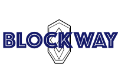

## By Nyk077771

BlockWay Application - Developed by Nyk077771 for NCI's Final Year Project
A dynamic DNS filtering solution that enhances Pihole with Machine Learning

# Current Features

- Pihole API integration.
- ML Scanning.
- Automatic DNS domains analysis.
- Web based informational dashboard.
- Logging.
- Authentication services.
- Role based access control.

# Prerequisites for Installation:

- Docker
- Docker Compose

# Instalation Guide:

Currently the application integrates within Debian based Linux Environment.
Works within Ubuntu based Raspberry Pi 5 environment.

### Step 1 - Clone the Repository

```bash
git clone https://github.com/Nyko77771/BlockWay.git
```

### Step 2 - Change into BlockWay directory

```bash
cd BlockWay
```
### Step 3 - Run the installation script to set up .env
#### Make sure you have Docker and docker compose
#### This install will automatically create docker images

```bash
sh installation.sh
```

### Step 4 - Run the Docker Compose Up to set up all the services

```bash
docker compose up
```

### Additional Steps
#### (for clients that aim to connect to the dashboard and Pi-hole services)

### Step 5 - Locate the IP of your host device 
(For Linux)

```bash
ifconfig -a
```
or
```bash
hostname -I
```

### Step 6 - Edit the hosts configuration on client machine

##### On Mac:
  1. Locate hosts configuration file (/etc/hosts)
  2. Open and change the configuration of hosts file to have the host ip be linked to Pihole and Block-Way:
     Add Lines:
       ' <your host ip> pihole.local'
       ' <your host ip> block-way.local'

##### Windows:
  1. Go to 'C:\Windows\System32\drivers\etc'
    2. Open and change the configuration of hosts file to have the host ip be linked to Pihole and Block-Way:
     Add Lines:
       ' <your host ip> pihole.local'
       ' <your host ip> block-way.local'

##### Linux:
  1. Go to '/etc'
    2. Open and change the configuration of hosts file to have the host ip be linked to Pihole and Block-Way:
     Add Lines:
       ' <your host ip> pihole.local'
       ' <your host ip> block-way.local'

### Step 7 - Retrieve Caddy's self-signeed certificate for local development
  1. On the host machine enter the docker shell for caddy container
     - 'docker exec -it caddy sh'
  2. Go to '/data/caddy/certificates/'
  3. Extract root.crt information
  4. Add the root.crt to browsers trusted certificate list.

### Step 8 - Connect to block-way
  1. Use:
     https://block-way.local

### Step 9 - Connect to Pihole
  1. Use:
     https://pihole.local

# How it works:
1. BlockWay connects to Pi-hole API.
2. Recent DNS queries are retrieved.
3. These domains are separated into blocked and allowed.
4. The ml models analyse allowed domains not previously encountered.
5. First evaluated using Logistic Regression.
6. Second, with Random Forrest for better prediction.
7. Dashboard displays statistics.

## Future Development Roadmap:

- [ ] Settings Page.
  - [ ] Night Mode.
  - [ ] Email Alert.
  - [ ] Notification Feature.
- [ ] Normal Dash Polishing.
  - [ ] Error Correction.
- [ ] Authentication
  - [ ] Admin-specific multi-factor authentication.
  - [ ] Token Recovery.
- [ ] Account Lockout.
- [ ] Admin Dashboard.
- [ ] Additional ML Models.
- [ ] User custom model selection.
- [ ] User-defined threshold functions.

## Disclaimer

This is an open source development all types of contributions are welcome. If you would like to change something you may discuss it wit the creator.


